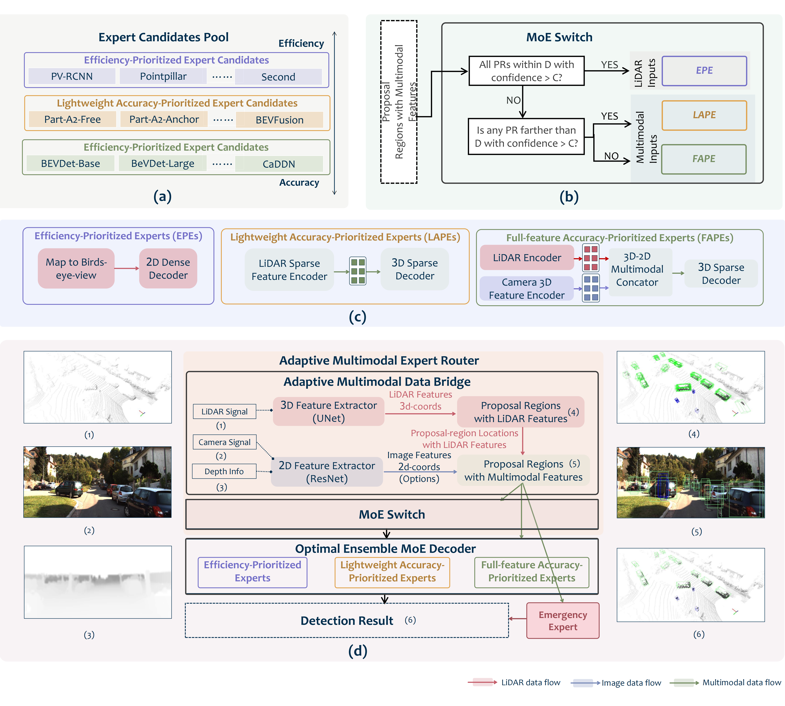

# EMOS
<!-- Repository for the TPAMI paper.
<!-- 1 -->
# EMC2 -->
[](https://opensource.org/licenses/MIT)

This is the official repo for implementation of paper [Towards Optimal Mixture of Experts System for 3D Object Detection: A Game of Accuracy, Efficiency and Adaptivity](https://arxiv.org/abs/2507.04123) [TPAMI2025].

Linshen Liu, Pu Wang, Guanlin Wu, Hao Frank Yang

<!-- 2 abstract  --> 
## Abstract
<!-- This paper presents Edge-based Mixture of Experts (MoE) Collaborative Computing (EMC2), an optimal computing system designed for autonomous vehicles (AVs) that simultaneously achieves low-latency and high-accuracy 3D object detection. Unlike conventional approaches, EMC2 incorporates a scenario-aware MoE architecture specifically optimized for edge platforms. By effectively fusing LiDAR and camera data, the system leverages the complementary strengths of sparse 3D point clouds and dense 2D images to generate robust multimodal representations. To enable this, EMC2 employs an adaptive multimodal data bridge that performs multi-scale preprocessing on sensor inputs, followed by a scenario-aware routing mechanism that dynamically dispatches features to dedicated expert models based on object visibility and distance. In addition, EMC2 integrates joint hardware-software optimizations, including hardware resource utilization optimization and computational graph simplification, to ensure efficient and real-time inference on resource-constrained edge devices. Experiments on open-source benchmarks clearly show the EMC2 advancements as a end-to-end system. On the KITTI dataset, it achieves an average accuracy improvement of 3.58% and a 159.06% inference speedup compared to 15 baseline methods on Jetson platforms, with similar performance gains on the nuScenes dataset, highlighting its capability to advance reliable, real-time 3D object detection tasks for AVs. The overall architecture of EMC2 is illustrated in Figure 1.


Autonomous vehicles, open-world robots, and other automated systems rely on accurate, efficient perception modules for real-time object detection. Although high-precision models improve reliability, their processing time and computational overhead can hinder real-time performance and raise safety concerns. This paper introduces an Edge-based Mixture-of-Experts Optimal Sensing (EMOS) System that addresses the challenge of co-achieving accuracy, latency and scene adaptivity, further demonstrated in the open-world autonomous driving scenarios. Algorithmically, EMOS fuses multimodal sensor streams via an Adaptive Multimodal Data Bridge and uses a scenario-aware MoE switch to activate only a complementary set of specialized experts as needed. The proposed hierarchical backpropagation and a multiscale pooling layer let model capacity scale with real-world demand complexity. System-wise, an edge-optimized runtime with accelerator-aware scheduling (e.g., ONNX/TensorRT), zero-copy buffering, and overlapped I/O–compute enforces explicit latency/accuracy budgets across diverse driving conditions. Experimental results establish \textsc{EMOS} as the new state of the art: on KITTI, it increases average AP by 3.17\% while running $2.6\times$ faster on Nvidia Jetson. On nuScenes, it improves accuracy by 0.2\% mAP and 0.5\% NDS, with 34\% fewer parameters and a $15.35 times Nvidia Jetson speedup. Leveraging multimodal data and intelligent experts cooperation, EMOS delivers accurate, efficient and edge-adaptive perception system for autonomous vehicles, thereby ensuring robust, timely responses in real-world scenarios. -->

This paper presents the Edge-based Mixture-of-Experts Optimal Sensing (EMOS) system, a hardware–software co-designed framework that jointly achieves high accuracy, low latency, and scene adaptivity for real-time 3D object detection in autonomous driving. Unlike conventional models that either sacrifice speed for accuracy or reduce precision for efficiency, EMOS integrates a scenario-aware mixture-of-experts (MoE) architecture explicitly optimized for edge deployment. By fusing multimodal sensor inputs through an adaptive multimodal data bridge, the system generates robust feature representations, while a dynamic routing mechanism selectively activates complementary expert models based on scene difficulty and object characteristics. To further enhance adaptability, EMOS introduces hierarchical backpropagation and multiscale pooling, enabling the model to scale capacity with the complexity of real-world driving environments. At the system level, EMOS incorporates accelerator-aware scheduling (e.g., ONNX/TensorRT), zero-copy buffering, and overlapped I/O–compute execution, ensuring efficient and real-time operation under resource constraints. Extensive experiments on open-source benchmarks highlight EMOS as a new state-of-the-art perception system. On the KITTI dataset, EMOS improves average detection accuracy by 3.17% while running 2.6× faster on NVIDIA Jetson devices. On the large-scale nuScenes benchmark, it increases accuracy by 0.2% in mean Average Precision and 0.5% in the nuScenes Detection Score, while reducing parameters by 34% and achieving a 15.35× inference speedup. By combining multimodal sensing, adaptive expert cooperation, and hardware-efficient optimization, EMOS delivers reliable, real-time perception for autonomous vehicles, ensuring robust and timely responses in complex traffic scenarios.

<!-- 3 here is the figure  -->  
<!-- 
*Figure 1: The architecture of our proposed model framework.* -->
<!-- <p align="center">
  
  <br/>
  <em>Figure 1: System architecture of EMC2. The central row shows the overall data flow, while the top and bottom illustrate key modules. EMC2 consists of five main components: an Adaptive Multimodal Data Bridge (AMDB) for preprocessing multimodal inputs; a Scenario-Adaptive Dispatcher that selects experts based on contextual cues; and three specialized experts—Latency-Prioritized, Versatile Efficiency, and Accuracy-Prioritized—each optimized for different real-time requirements. An Emergency Expert API handles hazardous or unseen cases.</em>
</p> -->

<p align="center">
  
</p>

<!-- *Figure 1: System architecture of EMC2. The central row shows the overall data flow, while the top and bottom illustrate key modules. EMC2 consists of five main components: an Adaptive Multimodal Data Bridge (AMDB) for preprocessing multimodal inputs; a Scenario-Adaptive Dispatcher that selects experts based on contextual cues; and three specialized experts—Latency-Prioritized, Versatile Efficiency, and Accuracy-Prioritized—each optimized for different real-time requirements. An Emergency Expert API handles hazardous or unseen cases.* -->

*Figure 1: System architecture of EMOS. The framework integrates four main modules. (a) The Expert Candidate Pool organizes specialized models into categories along the efficiency–accuracy trade-off. (b) The MoE Switch dynamically selects experts based on object distance and proposal confidence. (c) The Optimal Ensemble MoE Decoder fuses outputs from three expert types—Efficiency-Prioritized Experts (EPEs), Lightweight Accuracy-Prioritized Experts (LAPEs), and Full-feature Accuracy-Prioritized Experts (FAPEs)—each designed with distinct internal structures. (d) The full end-to-end pipeline shows how multimodal inputs are processed through these stages, with representative detection results illustrating the effectiveness of the system.*


<!-- 4 here is the installation requirement  -->   
<!-- ## Requirements -->
<!-- Requirements are provided in ``requirements.txt``. -->
<!-- 🛠️  -->

## Requirements

We build our project upon [OpenPCDet v0.5.2](https://github.com/open-mmlab/OpenPCDet) and [mmdetection3d](https://github.com/open-mmlab/mmdetection3d). Please follow the official instructions to install it first, including CUDA-compatible PyTorch and `spconv`.

Once OpenPCDet or mmdetection is installed, you can install additional dependencies by running:

<!-- ```bash
pip install -r requirements.txt -->
<pre> pip install -r requirements.txt </pre>


<!-- 5 here is training and installation code  -->   
## Model Training and Testing
The model is based on Openpcdet or mmdetection3d framework. Here is the detail process. For dataset access or questions, please contact us at: lliu148@jh.edu.
### Customized Training Dataset Preparing

Dataset Preparation for Expert Training

EMOS organizes training into three specialized experts: EPE (Efficiency-Prioritized Expert), FAPE (Full-feature Accuracy-Prioritized Expert), and LAPE (Lightweight Accuracy-Prioritized Expert).
Each expert is trained on a customized NuScenes subset defined by a scene list. These lists are stored in the repository under EMOS/Training/:

EMOS/Training/EPE_subdataset.txt

EMOS/Training/FAPE_subdataset.txt

EMOS/Training/LAPE_subdataset.txt

To generate the corresponding NuScenes information files for each expert, run the following commands from the EMOS root directory:

<pre>
python dataset/create_custom_nuscenes_info.py \
  --cfg_file tools/cfgs/dataset_configs/nuscenes_dataset.yaml \
  --version v1.0-trainval-EPE \
  --scene_list EMOS/Training/EPE_subdataset.txt

python dataset/create_custom_nuscenes_info.py \
  --cfg_file tools/cfgs/dataset_configs/nuscenes_dataset.yaml \
  --version v1.0-trainval-FAPE \
  --scene_list EMOS/Training/FAPE_subdataset.txt

python dataset/create_custom_nuscenes_info.py \
  --cfg_file tools/cfgs/dataset_configs/nuscenes_dataset.yaml \
  --version v1.0-trainval-LAPE \
  --scene_list EMOS/Training/LAPE_subdataset.txt
</pre>

These commands will generate .pkl for each experts. 

The construction methods for the three expert-specific subsets (i.e., EPE_subdataset.txt, FAPE_subdataset.txt, and LAPE_subdataset.txt) are described in the EMOS paper. If you have any question, please contact us via email.

### Efficiency and Accuracy Utility Calculation 
<!-- The utility functions used for expert categorization are provided in the repository under EMOS/Utility_function/. Specifically:

accuracy_utility.py: defines the Accuracy Utility function.

efficiency_utility.py: defines the Efficiency Utility function.

These functions are used to quantify the accuracy–efficiency trade-off when organizing experts into different categories within EMOS. -->

The repository provides utility functions to support expert categorization, located in EMOS/Utility_function/:

accuracy_utility.py defines the Accuracy Utility function.

efficiency_utility.py defines the Efficiency Utility function.

These functions are used to evaluate the balance between accuracy and efficiency when assigning experts to different categories within EMOS.

### Training Process
After generating the customized NuScenes info files, you can begin training the EMC2 model using the following command:
<pre> python train/train_EMOS.py </pre>

### Testing Process
Once training is complete, you can evaluate the model on the corresponding validation or test split using:
<pre>python test/test_EMOS.py</pre> 

<!-- You can later load them by updating the dataset INFO_PATH in the config file accordingly. -->

<!-- 5.1 Please Add the (1) installation process, (2)    -->   

<!-- ## Citation
If you find this useful, please cite the following paper:
```
@article{liu2025EMC2,
  title={Towards Accurate and Efficient 3D Object Detection for Autonomous Driving: A Mixture of Experts Computing System on Edge},
  author={Linshen Liu, Boyan Su, Junyue Jiang, Guanlin Wu, Cong Guo, Ceyu Xu, Hao Frank Yang},
  journal={arXiv preprint arXiv:2507.04123},
  year={2025}
}
``` -->
